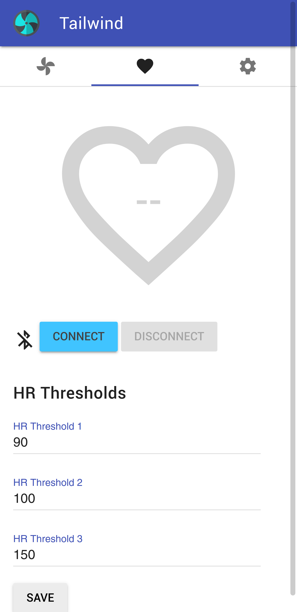

# Smart Fan for indoor cycling

Use a cheap ESP32 (e.g. a cheap [Wroom32](https://www.espressif.com/en/products/modules/esp-wroom-32/overview)) and an even cheaper standard relais board to build a smart controller for a fan. You can easily control the fan's speed from your smartphone while riding on your indoor trainer. 

Features:
 * WiFi configuration interface for easy setup
 * Webserver with easy UI (PWA) to control while on the bike
 * Heart rate based fan speed (with customizable thresholds)
 * BLE device relais for heart rate monitors only supporting single connection

## Heart rate based fan speed 
 As an additional feature, it can connect to a BLE heart rate sensor and set the fan speed based on thresholds of your heart rate. 

It will connect to the first discovered BLE device with the heart rate profile.

As many heart rate sensors only support a single connection, tailwind itself advertises a heart rate sensor and acts as a relais so you can still have your heart rate displayed in your favourite app. The sensor is called "Tailwind Fan" and also advertises as heart rate BLE profile.

**Note:** *The heart rate based feature is somewhat buggy and crashes after some time. Please feel free to investigate and/or fix.*

## Configuration

The controller features configuration page for setting up WiFi if not connected to any network. 

## Screenshots
  

## Dependencies

It uses the these Arduino Libraries, installable via the Arduino *Library Managerr*:
  * [ConfigManager](https://github.com/nrwiersma/ConfigManager)

To transfer the resources to the ESP32, install [Arduino ESP32 filesystem uploader](https://github.com/me-no-dev/arduino-esp32fs-plugin) and upload all files in the `data` folder.
